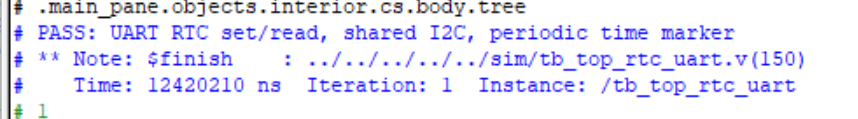
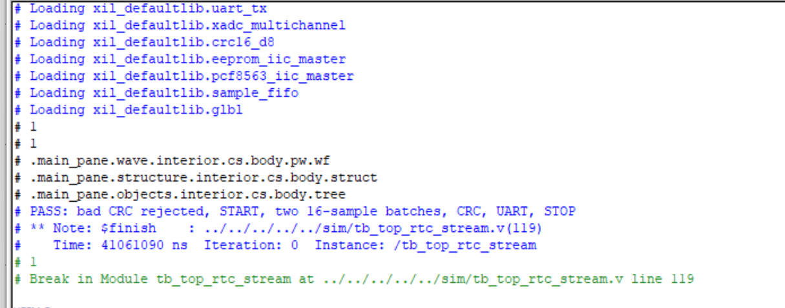
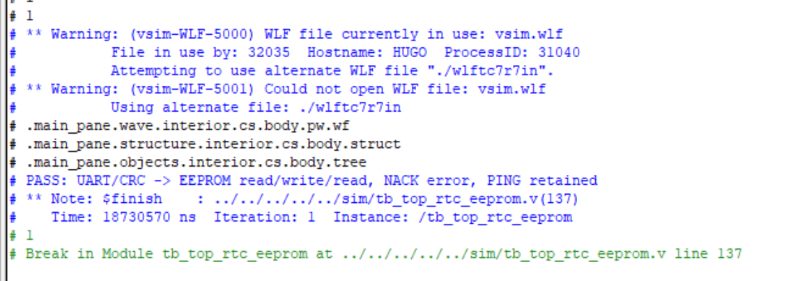

# Project 1 — FPGA Multi-Source Data Acquisition and Host Communication System

**Development: 2026.05.07–2026.07.12 · Board and system validation: 2026.09**

**Hardware: Davinci V2.1 / Xilinx Artix-7 XC7A35T · Tools: Vivado 2018.3, Verilog, ModelSim, MATLAB**

The project began with a UART PING command and grew to include XADC acquisition, two FIFOs, CRC-16 framing, I²C EEPROM access, and an RTC. After the v8 functional design was completed in July, the development board was acquired in September. Board checks for each release, final system regression, MATLAB live acquisition, and ILA captures were then completed. The final v8 bitstream is generated from the checked-in RTL and build scripts.

The acquisition source is the Artix-7 **on-chip XADC**, which reads four internal measurements: die temperature, VCCINT, VCCAUX, and VCCBRAM.

## Data path and protocol

```text
Four internal XADC measurements
       │  one rotating channel record every 1 ms
       ▼
16-bit × 64 sample FIFO ──► 16 records/frame + CRC-16 ──► 8-bit × 128 UART FIFO
                                                             │
                                                             ▼
                                                  UART 115200 8N1 ──► Python / MATLAB

UART RX + CRC check ──► command parser ──► acquisition control / EEPROM / RTC
                                               EEPROM and RTC share I²C SDA/SCL
```

Every 1 ms, the acquisition logic records one valid XADC reading, rotating among the four channels. This produces **1,000 records/s** in total, approximately **250 records/s per channel**. Each `TYPE=91` batch frame contains 16 channel-tagged records, a frame sequence number, and the cumulative dropped-sample count. The RTC sends a `TYPE=92` time marker approximately once per second, providing a second-resolution time anchor for subsequent sample batches.

The UART frame format is `A5 5A | TYPE | SEQ | LEN | PAYLOAD | CRC_LO | CRC_HI`. CRC-16/MODBUS covers `TYPE` through `PAYLOAD`, excluding the header. `crc16_d8.v` updates the CRC one byte at a time; an 8-bit × 128 FIFO buffers outgoing frame bytes. Command and payload layouts are described in the [protocol specification](PROTOCOL_V2.md), [four-channel format](MULTICHANNEL_V1.md), and [RTC integration notes](RTC_V1.md).

## Development history · 2026.05.07–07.12

| Period | Version | Work completed |
| --- | --- | --- |
| 05.07–05.11 | **v1 UART PING** | Established the 50 MHz reset scheme, UART TX/RX, CRC-8 command parsing, and PING response. This provided the first bidirectional PC–FPGA path. |
| 05.12–05.17 | **v2 single XADC reading** | Read the on-chip temperature through the DRP; added an on-demand read command and raw-code conversion. |
| 05.18–05.24 | **v3 UART TX FIFO** | Added an 8-bit × 128 FIFO between the frame builder and UART transmitter to queue reply bytes under consecutive commands. |
| 05.25–05.31 | **v4 CRC-16 framing** | Replaced CRC-8 with CRC-16/MODBUS and defined fixed header, type, sequence, and length fields. Added host-side command generation, decoding, and bad-frame checks. |
| 06.01–06.15 | **v5 continuous acquisition** | Added timed XADC temperature reads, a separate 16-bit × 64 sample FIFO, 16-sample batch frames, a cumulative drop counter, and START/STOP control. The XADC → FIFO → CRC → UART chain took shape. |
| 06.16–06.26 | **v6 I²C EEPROM** | Implemented single-byte random read/write for the on-board 24C64 from the board schematic, including ACK/NACK and the write cycle; integrated I²C operations into the UART command protocol. |
| 06.27–07.04 | **v7 four-channel XADC** | Expanded acquisition to temperature, VCCINT, VCCAUX, and VCCBRAM. Encoded a channel ID in each 16-bit record and introduced `TYPE=91` to distinguish the new batches from the earlier temperature-only stream. |
| 07.05–07.12 | **v8 RTC integration** | Added the on-board PCF8563 for time read/set and periodic time markers, with transaction coordination between RTC and EEPROM on the shared I²C bus. Existing streaming and EEPROM commands remained available. |

Stage-specific RTL, testbenches, and project-generation scripts are retained for regression. The final top level is [`rtl/top_rtc.v`](rtl/top_rtc.v). Implementation details for v5–v8 appear in the [continuous stream](STREAM_V1.md), [EEPROM](EEPROM_V1.md), [four-channel XADC](MULTICHANNEL_V1.md), and [RTC](RTC_V1.md) notes. During development, focused testbenches checked the FIFO, CRC, and I²C state machines; a system-level ModelSim regression followed in September.

The UART/FIFO, CRC-16, and EEPROM I²C foundations originated in XiaoBai FPGA course examples; the system framing, XADC/RTC integration, and validation described here are project work.

## Design and integration notes

**UART settings.** At the first board check, the serial utility was still configured for 19200 baud while the RTL used 115200. Setting both ends to 115200, 8N1, Hex restored PING and single XADC replies. Each later bitstream was checked with PING before testing its new function.

**Matching acquisition and UART throughput.** The sample FIFO stores 16-bit raw records; the UART FIFO stores framed 8-bit bytes. The packer drains samples in batches into the TX FIFO, while UART transmits at 115200 baud. The host checks frame sequence numbers and the FPGA's cumulative drop count to monitor data continuity.

**EEPROM write verification.** After a write, the controller waits 10 ms before a random read checks the stored value. The original byte at address `0x1FF0` was recorded before testing and restored afterward. This exercised both the write-cycle delay and random-read path.

**Shared RTC/EEPROM bus.** The schematic connects both devices to the same SDA/SCL pair. The v8 top level checks each controller's `busy`/`inflight` status so that only one I²C transaction owns the bus; periodic RTC reads also wait for EEPROM transactions. A shared-bus ModelSim test covers the arbitration, followed by board checks of RTC read/set, EEPROM regression, and stream time markers.

**Simulation and ILA debugging.** In ModelSim, `rtc_start`, `rtc_done`, and other internal signals were observed through the testbench's `dut` instance alongside I²C transactions and UART replies. For ILA START/STOP captures, a single `request_valid=1` trigger was used; command type and `streaming` transitions were then read from the same waveform segment.

## September board and system validation

After acquiring the board in September, each release received a USB UART command check before end-to-end v8 tests. The final bitstream met the 50 MHz timing constraint with **+13.422 ns WNS**. The [2026-09-17 five-second v8 capture](VALIDATION_V8_2026-09-17.md) yielded **312 `91` batch frames, 4,992 records, and five `92` time markers**. Each channel contributed 1,248 records; CRC errors, sequence gaps, and the FPGA-reported drop-count increase were all zero.

### ModelSim regression

Vivado 2018.3 invoked ModelSim 10.6c for three v8 system tests: UART/RTC time set and read, shared I²C, and periodic markers; bad-CRC rejection, two 16-sample batches, and START/STOP; and EEPROM write/readback, NACK, and PING regression. Testbenches, simulation stubs, and run steps are documented in [MODELSIM_V8.md](MODELSIM_V8.md).







### MATLAB host

[`matlab/project1_host.m`](matlab/project1_host.m) supports replay of raw UART captures, live acquisition, CRC checking, four-channel plots, and CSV/JSON export. A [five-second live capture](VALIDATION_MATLAB_2026-09-17.md) received **313 sample frames, 5,008 records, and five RTC markers**, with zero CRC errors. The test script also corrupts one frame to verify CRC-error and sequence-gap detection. Usage is in [MATLAB_HOST.md](MATLAB_HOST.md); see the [test screenshot](evidence/matlab/replay_pass.png).

### On-board ILA

A separate debug bitstream inserts seven probe groups into the synthesized netlist while retaining the v8 functional RTL. Captures showed PING command type `01`, `streaming: 0→1` on START, `streaming: 1→0` on STOP, and `send_state: 0→3` after RTC-read completion. The corresponding serial RTC reply was `TYPE=87` with a valid CRC. Capture steps and five screenshots are in [ILA_BOARD_GUIDE.md](ILA_BOARD_GUIDE.md) and [`evidence/ila/`](evidence/ila/).

### Two-hour v8 run

On 2026-09-18, the final functional bitstream ran for **7200.009 seconds**. The host received **449,989 four-channel sample frames, 7,199,824 records** (1,799,956 per channel), and **7,199 consecutive one-second RTC markers**. Both START and STOP acknowledgments arrived. CRC errors, sequence gaps, and the FPGA-reported drop-count increase were **zero**. Offline replay of the raw UART stream matched the live summary. Data and checks are in the [final validation record](VALIDATION_FINAL_2026-09-18.md); reproduction commands are in the [two-hour run procedure](FINAL_LONG_RUN.md).

## Rebuild from source

This repository contains RTL, testbenches, board constraints, the FIFO IP configuration (`ip/fifo_w8xd128.xci`), host tools, and Vivado Tcl scripts. Generated `vivado_*` projects, bitstreams, probe files, and the full two-hour capture are excluded. The [final validation record](VALIDATION_FINAL_2026-09-18.md) retains the measured results and raw-stream SHA-256. Small [v7](fixtures/v7_short_uart.bin) and [v8](fixtures/v8_short_uart.bin) UART captures are included as offline decoding fixtures; the MATLAB replay test uses the v8 fixture.

From the repository root with Vivado 2018.3 available:

```tcl
vivado -mode batch -source create_rtc_project.tcl
vivado -mode batch -source build_rtc_bitstream.tcl
```

The first command generates `vivado_rtc/project1_uart_rtc.xpr` from the checked-in sources; the second builds its bitstream locally. To configure ModelSim for the generated project, run `vivado -mode batch -source configure_modelsim_v8.tcl`. For the ILA build, see [ILA_BOARD_GUIDE.md](ILA_BOARD_GUIDE.md) and the checked-in `create_ila_project.tcl` / `insert_ila_debug.tcl` scripts. Earlier-stage projects can be regenerated with their matching `create_*_project.tcl` and `build_*_bitstream.tcl` scripts.

## Project entry points

| Item | Path |
| --- | --- |
| Final RTL / Vivado build scripts | [`rtl/top_rtc.v`](rtl/top_rtc.v) / [`create_rtc_project.tcl`](create_rtc_project.tcl) / [`build_rtc_bitstream.tcl`](build_rtc_bitstream.tcl) |
| Stage reconstruction scripts | [`create_project.tcl`](create_project.tcl), [`create_fifo_project.tcl`](create_fifo_project.tcl), [`create_crc16_project.tcl`](create_crc16_project.tcl), [`create_stream_project.tcl`](create_stream_project.tcl), [`create_eeprom_project.tcl`](create_eeprom_project.tcl), [`create_multichannel_project.tcl`](create_multichannel_project.tcl) |
| RTL / simulation testbenches | [`rtl/`](rtl/) / [`sim/`](sim/) |
| Pin constraints / FIFO IP configuration | [`constraints/`](constraints/) / [`ip/fifo_w8xd128.xci`](ip/fifo_w8xd128.xci) |
| Serial command generation, decoding, and stream monitoring | [`host/protocol_crc16.py`](host/protocol_crc16.py) / [`host/stream_monitor.py`](host/stream_monitor.py) |
| MATLAB / ModelSim / ILA | [MATLAB_HOST.md](MATLAB_HOST.md) / [MODELSIM_V8.md](MODELSIM_V8.md) / [ILA_BOARD_GUIDE.md](ILA_BOARD_GUIDE.md) |
| Short UART replay fixtures / board captures | [`fixtures/`](fixtures/) / [`evidence/`](evidence/) |

On-board serial settings: 115200 baud, 8N1, no flow control.
